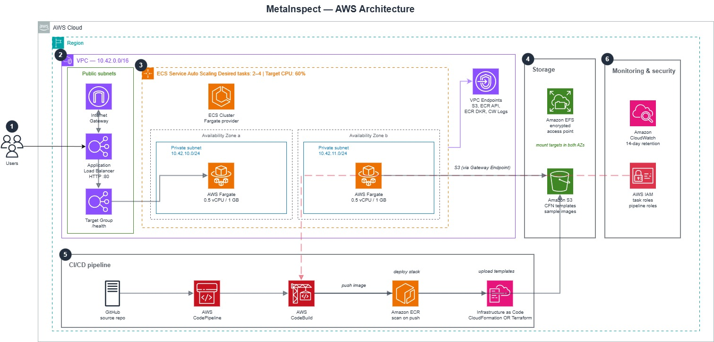

# MetaInspect Containers

Containerized image metadata extraction service with AWS-native deployment automation.

This project demonstrates:
- Secure image upload and metadata extraction (`JPG/JPEG/PNG`)
- Metadata sanitization and configurable sensitive-field redaction
- ECS Fargate deployment behind ALB with optional EFS shared storage
- Dual IaC support: **CloudFormation** (nested stacks) and **Terraform** (modular)
- VPC Endpoints instead of NAT Gateways for cost-efficient private subnet connectivity
- GitHub-triggered CodePipeline + CodeBuild CI/CD with a single-parameter IaC toggle

## Architecture



## Core Stack

- Python Flask + Gunicorn
- ExifTool for metadata extraction
- Docker
- AWS CloudFormation (nested stacks) **or** Terraform (modules)
- Amazon ECR, ECS Fargate, ALB, EFS, CloudWatch
- AWS CodePipeline + CodeBuild + CodeConnections
- VPC Endpoints (S3 Gateway, ECR, CloudWatch Logs)

## Repository Structure

```text
.
|-- app.py                       # Flask application
|-- Dockerfile
|-- buildspec.yml                # CodeBuild spec (CloudFormation path)
|-- buildspec-terraform.yml      # CodeBuild spec (Terraform path)
|-- templates/                   # Flask HTML templates
|-- static/                      # CSS assets
    `-- infra/
    |-- cloudformation/
    |   |-- root.yaml            # Parent nested stack
    |   |-- templates/           # Nested stack templates
    |   |-- params/              # Environment parameter files
    |   `-- scripts/             # Local deployment script
    `-- terraform/
        |-- main.tf              # Root module orchestrator
        |-- variables.tf
        |-- outputs.tf
        |-- providers.tf
        |-- backend.tf           # S3 remote state
        |-- modules/             # One module per infrastructure concern
        `-- environments/
            `-- dev/
                `-- terraform.tfvars
```

## Local Run

```bash
docker build -t metainspect:local .
docker run --rm -p 8080:80 \
  -v metainspect_shared:/efs/shared \
  -e MAX_UPLOAD_BYTES=20971520 \
  metainspect:local
```

Open the app at `http://localhost:8080`.

## Runtime Endpoints

- `GET /` - upload UI
- `POST /upload` - image upload and metadata extraction
- `GET /health` - health check
- `GET /runtime` - live task/runtime metadata
- `GET /sample-images/download` - redirect to presigned S3 sample ZIP

## AWS Deployment

### Prerequisites (avoid common first-run failures)

1. **Nested template bucket (handled by IaC)** — The `cicd.yaml` stack **creates** a dedicated S3 bucket for nested templates and attaches a **bucket policy** so **CloudFormation** can `GetObject` on the synced YAML. You do **not** need to pre-create that bucket or edit S3 policies by hand (unless you use a **fork** of an older template that still required `CloudFormationBucketName`).
2. **`FullRepositoryId`** — Use **`owner/repo`** only (example: `OrieBound/metainspect-containers`). Do **not** use a full GitHub URL; CodePipeline will fail the Source stage (e.g. *No Branch [main] found*).
3. **GitHub connection** — In **Developer Tools → Connections**, the connection must be **Available** (finish the GitHub authorization if it is still **Pending**).
4. **Branch name** — Must exist on the repo (`main` vs `master`).
5. **Region** — Deploy the CI/CD stack and run the pipeline in the same region you expect for the app (examples use **`us-east-1`**).
6. **Failed root stack** — If `metainspect-root-dev` (or your `StackName`) ends in **`ROLLBACK_COMPLETE`**, **delete** that stack before expecting a clean bootstrap on the next run.

### IaC Toggle

Both CloudFormation and Terraform produce identical infrastructure. The CI/CD pipeline (`cicd.yaml`) accepts a `BuildSpecFile` parameter to select which path to use:

| IaC Tool       | BuildSpecFile               | Infrastructure Config          |
|----------------|-----------------------------|--------------------------------|
| CloudFormation | `buildspec.yml` (default)   | `infra/cloudformation/`        |
| Terraform      | `buildspec-terraform.yml`   | `infra/terraform/`             |

### Deploy CI/CD Pipeline

**Every AWS account is different.** You must supply **your own** GitHub connection ARN and repo id (nothing in the cloned repo can embed “the” correct `ConnectionArn` for someone else’s account):

1. In **your** AWS account: **Developer Tools → Connections** → create/authorize GitHub → copy **ConnectionArn** (often `arn:aws:codeconnections:...`).
2. Set **`FullRepositoryId`** to **`owner/repo`** for the repo the pipeline should clone (your fork, e.g. `you/metainspect-containers`, or upstream `OrieBound/metainspect-containers`).
3. Either pass those in `--parameter-overrides` below, or copy `infra/cloudformation/params/cicd-dev.json` to **`cicd-dev.local.json`**, edit placeholders there, and deploy with the `jq` command in `infra/cloudformation/params/README.md` (local file is **gitignored**).

```bash
aws cloudformation deploy \
  --stack-name metainspect-cicd-dev \
  --template-file infra/cloudformation/templates/cicd.yaml \
  --capabilities CAPABILITY_NAMED_IAM \
  --region us-east-1 \
  --parameter-overrides \
    ProjectName=metainspect \
    EnvironmentName=dev \
    ConnectionArn=<your-codeconnections-arn> \
    FullRepositoryId=<org/repo> \
    BranchName=main \
    StackName=metainspect-root-dev \
    BuildSpecFile=buildspec.yml
```

Optional: add `CloudFormationTemplatePrefix=metainspect/templates` if you do not use the default prefix. Use `--profile <name>` if you use AWS SSO / named profiles.

After deploy, stack output **`CfnTemplatesBucketName`** is the bucket CodeBuild uses for nested templates (policy already allows CloudFormation read).

Set `BuildSpecFile=buildspec-terraform.yml` to use the Terraform path instead.

### Two-Phase Deployment

Both IaC paths follow the same strategy:

1. Deploy core infrastructure with service disabled (`DeployService=false` / `deploy_service=false`)
2. Build and push Docker image to ECR
3. Enable ECS service with the image tag (`DeployService=true` / `deploy_service=true`)

This avoids ECS service creation before the container image exists in ECR.

### Trigger Pipeline

```bash
aws codepipeline start-pipeline-execution --name metainspect-dev-pipeline --region us-east-1
```

Or push to the `main` branch -- the pipeline triggers automatically.

### Tear Down

**CloudFormation path:**
```bash
aws cloudformation delete-stack --stack-name metainspect-root-dev --region us-east-1
```

**Terraform path:**
```bash
cd infra/terraform
terraform init
terraform destroy -var-file="environments/dev/terraform.tfvars" -var="deploy_service=true"
```

Then delete the CI/CD stack (after emptying its artifacts bucket):
```bash
aws cloudformation delete-stack --stack-name metainspect-cicd-dev --region us-east-1
```

## Network Architecture

Private ECS tasks access AWS services through VPC Endpoints instead of NAT Gateways:

| Endpoint            | Type      | Purpose                          | Cost        |
|---------------------|-----------|----------------------------------|-------------|
| S3                  | Gateway   | ECR image layers, state storage  | Free        |
| ECR API             | Interface | Container image pull API         | ~$7.20/mo   |
| ECR DKR             | Interface | Container image pull (Docker)    | ~$7.20/mo   |
| CloudWatch Logs     | Interface | Log shipping                     | ~$7.20/mo   |

This saves ~$42/month compared to NAT Gateways while providing the same connectivity for AWS API access.

## Configuration

Application environment variables:
- `REDACTION_MODE` (default `true`)
- `REDACT_KEY_PARTS` (comma-separated key fragments)
- `REDACTED_VALUE` (default `[REDACTED]`)
- `MAX_UPLOAD_BYTES` (default `20971520`)
- `DELETE_AFTER_PROCESS` (default `true`)
- `SHARED_DIR` (default `/efs/shared`)
- `SAMPLE_IMAGES_S3_BUCKET`
- `SAMPLE_IMAGES_S3_KEY`
- `SAMPLE_IMAGES_URL_TTL` (default `28800`)
- `AWS_REGION` (default `us-east-1`)

## Security Notes

- No static AWS credentials in code.
- Presigned URL generation uses ECS task role permissions.
- Keep local secrets out of source control (`.env` files, cloud credentials, private keys).
- Redaction mode is enabled by default to reduce exposure of sensitive EXIF fields.

## Additional Documentation

- Contribution guide: `CONTRIBUTING.md`
- Security policy: `SECURITY.md`
- Infrastructure/deployment guide: `infra/cloudformation/README.md`
